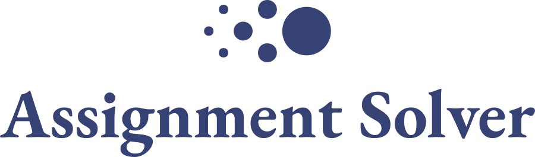

<div align="center">
  
  <p><br />This repository is the solver developed to assign volunteers to students for Diplome Avant La Médaille.</p>
</div>


## Introduction

DAM offers a tutoring program to high school students. They needed a tool to automatically assign volunteers (tutors) to students. 

A student and a tutor can only be matched if:

-	They share at least 1 hour availability
-	The student's school is part of the preferred tutor's schools.
-	A student can only be paired with at most one tutor.
-	A tutor can only be paired with at most one student.

And we maximize:

- Pair the most number of students.
- Assign most tutors to their preferred schools.
- Pair the students most needed subjects with the tutors preferred subjects.

To learn more about this project, read our [blog post](https://www.hectiq.ai/en/blog/posts/dam).

## Usage

Get help with the arguments:
```
python src/main.py --help
```

## Example with synthetic data

Run
```
python ./src/main.py -o ./result.xlsx -ns 100 -nt 100 -w 10
```

The script will output a file `result.xlsx` with the pairs.
